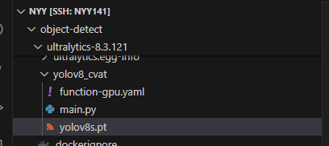
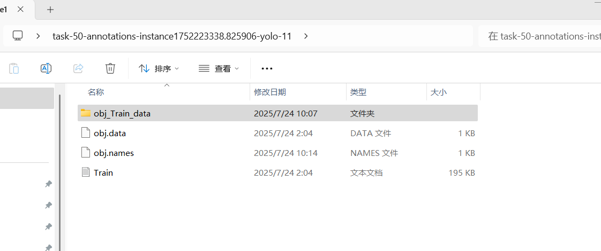
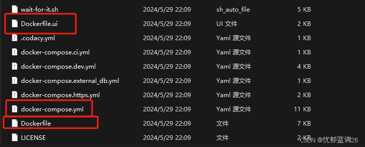
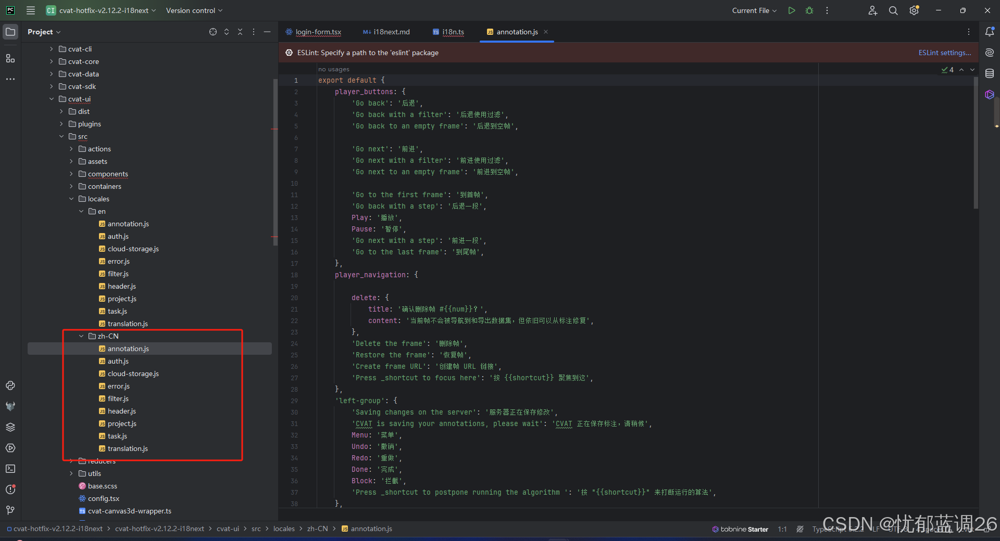

# CVAT 安装

### CVAT 拉取 
https://github.com/cvat-ai/cvat
git clone https://github.com/cvat-ai/cvat
### 安装命令
```bash
cd cvat
export CVAT_HOST=172.16.66.33
export CVAT_HOST=172.16.66.141
docker compose up -d
创建超级用户
docker exec -it cvat_server bash -ic 'python3 ~/manage.py createsuperuser'
xiyafei@hdzk.cn
```

### 配置共享文件夹

```bash
在docker-compose.yml 文件中修改全部 cvat_data:/home/django/data
volumes:
  # - ./cvat_data:/home/django/data
  - /home/nyy/object-detect/Myolotrain/Myolotrain/cvat_data:/home/django/data 
```

### 重启

```bash
启动
export CVAT_HOST=172.16.66.33
export CVAT_HOST=172.16.66.141
docker compose -f docker-compose.yml up -d 
关闭
docker compose -f docker-compose.yml down -d 
```

# 安装预训练模型

## 运行官方yolov3

1、运行如下命令来启动Cvat

```
docker compose -f docker-compose.yml -f components/serverless/docker-compose.serverless.yml up -d
```

如果想要停止，请运行

```
docker compose -f docker-compose.yml -f components/serverless/docker-compose.serverless.yml down
```

2、安装使用unctl命令行工具

找到Cvat目录下的components/serverless/docker-compose.serverless.yml，安装对应版本好的nuctl

```bash
# wget https://github.com/nuclio/nuclio/releases/download/1.11.24/nuctl-1.11.24-linux-amd64
wget https://github.com/nuclio/nuclio/releases/download/1.13.0/nuctl-1.13.0-linux-amd64
wget https://github.com/nuclio/nuclio/releases/download/<version>/nuctl-<version>-linux-amd64
```


3、加上执行权限，创建[软连接](https://so.csdn.net/so/search?q=软连接&spm=1001.2101.3001.7020)

```bash
sudo chmod +x nuctl-1.13.0-linux-amd64
sudo ln -sf $(pwd)/nuctl-1.13.0-linux-amd64 /usr/local/bin/nuctl
```

服务器中没有sudo权限，使用配置环境变量使用

```bash
export PATH=$PATH:/home/nyy/nuctl
export LD_LIBRARY_PATH=$LD_LIBRARY_PATH:/home/nyy/nuctl
```

4、执行下面的命令后会自动创建一个"cvat"的Nuclio项目，并构建cvat内置的自动标注模型。（**这一步报错的话，直接去看第三步的解决办法**）

```
./serverless/deploy_cpu.sh serverless/openvino/dextr
./serverless/deploy_cpu.sh serverless/openvino/omz/public/yolo-v3-tf
```

#### 问题：cvat nuclio部署遇到Unable to find image 'gcr.io/iguazio/alpine:3.17' locally

步骤一、先主动拉取该镜像，这个时候拉取的标签不是gcr.io/iguazio

```
docker pull alpine:3.17
```

步骤二、在这个步骤将刚才拉取的镜像修改tag为gcr.io/iguazio，因为nuclio执行的镜像名称是按照全称gcr.io/iguazio/alpine:3.17执行

```
docker tag 775f483016a7 gcr.io/iguazio/alpine:3.17
```

最后、重复一开始的操作就可解决问题

## 运行配置yolov8 模型

参考：[【深度学习】ubuntu系统下docker部署cvat的自动标注功能（yolov8 segmentation）_cvat部署-CSDN博客](https://ycx666.blog.csdn.net/article/details/142525807?spm=1001.2101.3001.6650.1&utm_medium=distribute.pc_relevant.none-task-blog-2~default~BlogCommendFromBaidu~Ctr-1-142525807-blog-146054099.235^v43^pc_blog_bottom_relevance_base1&depth_1-utm_source=distribute.pc_relevant.none-task-blog-2~default~BlogCommendFromBaidu~Ctr-1-142525807-blog-146054099.235^v43^pc_blog_bottom_relevance_base1&utm_relevant_index=2)

#### 1、建立文件夹：

包含三个文件：function-gpu.yaml、main.py、yolov8s.pt



function-gpu.yaml：使用可以推理的yolov8docker：myolotrain:v2

```yaml
metadata:
  name: yolov8_det
  namespace: cvat
  annotations:
    name: YOLOv8
    type: detector
    framework: pytorch
    spec: |
      [
        { "id": 1, "name": "person" },
        { "id": 2, "name": "car" }
      ]
spec:
  description: YOLOv8 Object Detection
  runtime: "python:3.8"
  handler: main:handler
  eventTimeout: 30s

  triggers:
    myHttpTrigger:
      maxWorkers: 1
      kind: "http"
      workerAvailabilityTimeoutMilliseconds: 10000
      attributes:
        maxRequestBodySize: 33554432 # 32MB

  build:
    image: cvat/yolov8_det
    baseImage: myolotrain:v2
    commands:
      - mkdir /opt/nuclio
  platform:
    attributes:
      restartPolicy:
        name: always
        maximumRetryCount: 3
      mountMode: volume
```

main.py

```python
import io
import base64
import numpy as np
import cv2
from PIL import Image
from ultralytics import YOLO
import json

def init_context(context):
    """Initialize the YOLOv8 model with .pt weights"""
    context.logger.info("Initializing YOLOv8 model")
    
    # 指定模型路径（使用yolov8s.pt）
    model_path = "/opt/nuclio/yolov8s.pt"
    
    # 加载PyTorch格式的模型
    context.user_data.model = YOLO(model_path)
    context.logger.info(f"Model {model_path} loaded successfully")

def handler(context, event):
    """Handle inference requests"""
    context.logger.info("Processing new request")
    
    try:
        context.logger.info("Run yolov8 model")
        data = event.body
        buf = io.BytesIO(base64.b64decode(data["image"]))
        threshold = float(data.get("threshold", 0.5))
        print(f"============ threshold {threshold} ")
        image = Image.open(buf)
        # names = context.user_data.model.names        
        # 2. 运行推理
        results = context.user_data.model(image)        
        # 3. 格式化结果为CVAT兼容的JSON
        annotations = []
        for result in results:
            for box in result.boxes:
                con_thre = float(box.conf.item())
                if con_thre >= threshold:                    
                    annotations.append({
                        "confidence": str(con_thre),
                        "label": result.names[int(box.cls)],  # 类别名称
                        "points": [
                            (int)(box.xyxy[0][0].item()),  # x1
                            (int)(box.xyxy[0][1].item()),  # y1
                            (int)(box.xyxy[0][2].item()),  # x2
                            (int)(box.xyxy[0][3].item())   # y2
                        ],
                        "type": "rectangle",
                    })
        return context.Response(body=json.dumps(annotations), headers={},
        content_type='application/json', status_code=200)
    
    except Exception as e:
        context.logger.error(f"Error during inference: {str(e)}")
        return context.Response(
            body={"error": str(e)},
            headers={},
            content_type="application/json",
            status_code=500
        )
```

### 2、启动doker环境

使用cvat ./serverless/deploy_gpu.sh启动docker；deploy_gpu.sh脚本学习：[Cvat部署自动标注_cvat自动标注-CSDN博客](https://blog.csdn.net/weixin_59534602/article/details/141058221?utm_medium=distribute.pc_relevant.none-task-blog-2~default~baidujs_baidulandingword~default-4-141058221-blog-135137755.235^v43^pc_blog_bottom_relevance_base1&spm=1001.2101.3001.4242.3&utm_relevant_index=7)

```bash
#!/bin/bash
# 用于在CPU上部署Nuclio函数的示例脚本

set -eu  # 当命令返回非零状态时退出脚本，未初始化变量时退出脚本

# 获取当前脚本所在目录路径
SCRIPT_DIR="$( cd "$( dirname "${BASH_SOURCE[0]}" )" >/dev/null 2>&1 && pwd )"

# 如果传入了参数，则将其作为函数目录路径；否则使用脚本所在目录
FUNCTIONS_DIR=${1:-$SCRIPT_DIR}

# 启用Docker BuildKit以优化构建过程
export DOCKER_BUILDKIT=1

# 构建OpenVINO基础镜像
docker build -t cvat.openvino.base "$SCRIPT_DIR/openvino/base"

# 创建一个名为 'cvat' 的Nuclio项目，平台为本地
nuctl create project cvat --platform local

# 启用globstar，允许递归匹配目录中的所有文件
shopt -s globstar

# 遍历指定目录下的所有 function.yaml 配置文件
for func_config in "$FUNCTIONS_DIR"/**/function.yaml
do
    # 获取当前函数的根目录
    func_root="$(dirname "$func_config")"
    
    # 获取相对于脚本目录的函数路径
    func_rel_path="$(realpath --relative-to="$SCRIPT_DIR" "$(dirname "$func_root")")"

    # 如果存在Dockerfile，构建基础镜像
    if [ -f "$func_root/Dockerfile" ]; then
        docker build -t "cvat.${func_rel_path//\//.}.base" "$func_root"
    fi

    echo "Deploying $func_rel_path function..."
    # 部署函数
    nuctl deploy --project-name cvat --path "$func_root" \
        --file "$func_config" --platform local
done

# 列出当前本地平台上已部署的所有函数
nuctl get function --platform local


```

部署命令：

```bash
成功命令：
./serverless/deploy_gpu.sh /home/nyy/object-detect/ultralytics-8.3.121/yolov8_cvat
未成功：
nuctl deploy -p /home/nyy/object-detect/ultralytics-8.3.121/yolov8_cvat -n cvat --platform local
```

### 3、测试

部署docker成功后有如下显示：其中 32826 表示docker服务端口：

使用 post http://172.16.66.141:32826 即可测试main.py是否正常。

```bash

25.08.08 10:14:43.988 (I)            nuctl.platform Docker image was successfully built and pushed into docker registry {"image": "cvat/yolov8_det:latest"}
25.08.08 10:14:43.988 (I)                     nuctl Build complete {"image": "cvat/yolov8_det:latest"}
25.08.08 10:14:43.998 (I)                     nuctl Cleaning up before deployment {"functionName": "yolov8_det"}
25.08.08 10:14:44.034 (I)                     nuctl Function already exists, deleting function containers {"functionName": "yolov8_det"}
25.08.08 10:14:56.820 (I)            nuctl.platform Waiting for function to be ready {"timeout": 120}
25.08.08 10:14:58.719 (I)                     nuctl Function deploy complete {"functionName": "yolov8_det", "httpPort": 32826, "internalInvocationURLs": ["192.168.0.22:8080"], "externalInvocationURLs": ["0.0.0.0:32826"]}
 NAMESPACE | NAME                           | PROJECT | STATE | REPLICAS | NODE PORT
 nuclio    | openvino-omz-public-yolo-v3-tf | cvat    | ready | 1/1      | 32768
 nuclio    | yolov8_det                     | cvat    | ready | 1/1      | 32826

```


问题：Error - Function cannot be updated when existing function is being provisioned

在 [Functions | Nuclio](http://172.16.66.141:8070/projects/cvat/functions)  中删除即可

# 更新已经标注标签

```
使用Upload annotations 更新
```

数据标签结构：



# 配置允许嵌套

- 如果不需要防护，直接 **删除 `X-Frame-Options` 或 CSP 的 `frame-ancestors`** 头部即可（默认允许嵌套）。

在 /home/nyy/object-detect/cvat-2.39.0/cvat-ui 路径中的react_nginx.conf 此代码注释

```
# add_header X-Frame-Options "deny";
```

在/home/nyy/object-detect/cvat-2.39.0/docker-compose.yml 中添加DISABLE_X_FRAME_OPTIONS: 'true'  # 禁用X-Frame-Options

```
  cvat_server:
    container_name: cvat_server
    image: cvat/server:${CVAT_VERSION:-v2.39.0}
    restart: always
    depends_on:
      <<: *backend-deps
      cvat_opa:
        condition:
          service_started
    environment:
      POSTGRES_USER: root
      <<: [*backend-env, *clickhouse-env]
      DJANGO_MODWSGI_EXTRA_ARGS: ''
      ALLOWED_HOSTS: '*'
      ADAPTIVE_AUTO_ANNOTATION: 'false'
      NUMPROCS: 2
      CVAT_ANALYTICS: 1
      CVAT_BASE_URL:
      ONE_RUNNING_JOB_IN_QUEUE_PER_USER:
      CVAT_HOST: 'localhost:8000'
      CORS_ALLOWED_ORIGINS: '*'
      CORS_ALLOW_CREDENTIALS: 'true'
      CSRF_TRUSTED_ORIGINS: '*'
      DISABLE_CROSS_ORIGIN_OPENER_POLICY: 'true'
      # 添加以下配置以禁用X-Frame-Options并设置CSP
      DISABLE_X_FRAME_OPTIONS: 'true'  # 禁用X-Frame-Options
      CSP_FRAME_ANCESTORS: "'self' http://172.16.66.33:8000/"  # 允许指定IP和端口的域名嵌入
```


# 汉化

##### 拉Cvat的i18n分支代码

首先将[Cvat的i18n分支（点我打开）](https://github.com/acecode/cvat/tree/hotfix/v2.12.2-i18next)拉到本地，我们要用这个分支的docker-compose.yml文件来构建镜像。
或者下载代码zip，将文件解压到你的centos或者ubuntu系统。
文件内容如图，留意这3个文件：



其中在docker-compose.yml中修改版本

```
# image: cvat/ui:${CVAT_VERSION:-v2.39.0}
  image: cvat/ui:${CVAT_VERSION:-v2.12.1}
```

##### 构建cvat/ui镜像

构建前先说几句：之前用[cvat](https://so.csdn.net/so/search?q=cvat&spm=1001.2101.3001.7020)的主分支的docker-compose.yml构建的镜像，里面没有i18n工具。

我们打开**Cvat的i18n分支代码**文件，可以看到ui目录下有[i18n](https://so.csdn.net/so/search?q=i18n&spm=1001.2101.3001.7020)配置及中文。



正式开始前，我们需要**确保**自己的docker中没有这个版本的ui镜像。
如果你目前使用的版本不是2.12.1的话，可以顺带把对应版本的删除一下：

```
docker rmi cvat/ui:v2.39.0
构建cvat/ui:v2.39.0 版本docker
mv Dockerfile Dockerfile.server
mv Dockerfile.ui Dockerfile
docker build -t cvat/ui:v2.39.4 .
docker build -t cvat/ui:v2.39.4 -f Dockerfile.ui .
docker build -t cvat/ui:v2.39.5 -f Dockerfile-hh.ui .
docker build -t cvat/ui:v2.39.7 -f Dockerfile.ui .
docker build -t cvat/ui:v2.39.8 -f Dockerfile.ui .

docker build -t cvat/ui:v2.39.0 -f Dockerfile.ui .

docker build -t cvat/ui:feati18next .
```

**先cd到你的cvat目录（Cvat的i18n分支中含有Dockerfile的目录）**，不需要改任何代码，运行下面命令。
这一步其实就是将Dockerfile.ui文件改名为Dockerfile，可以通过Docker命令来构建ui镜像。

```
mv Dockerfile Dockerfile.server
mv Dockerfile.ui Dockerfile
docker build -t cvat/ui:v2.12.1 .
```

等待构建完成。（这一步大概2000多秒，可能网络问题）

##### 重新启动docker

```
启动
export CVAT_HOST=172.16.66.141
export CVAT_HOST=172.16.66.33
docker compose up -d
docker compose -f docker-compose.yml up -d 
关闭 删除docker
docker compose down
docker compose -f docker-compose.yml down
```

#### 汉化总结

1、cva_2.39.0版本无法使用 Cvat的i18n分支汉化，i18n分支支持v2.12.1版本，下一版本v2.31.0待开发

2、如果汉化需采用其他路径
