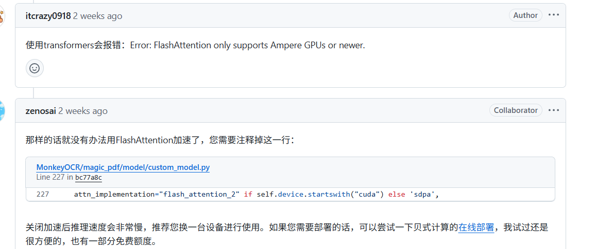
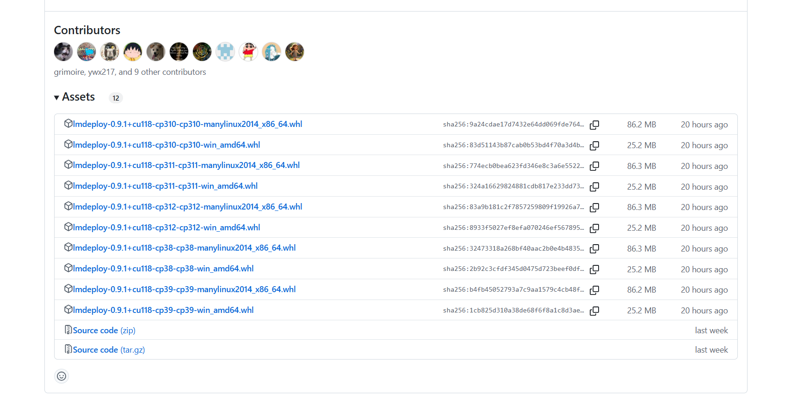

### MonkeyOCR 配置是失败记录

当前不支持Tesla P40和T40 显卡部署；只支持： **Turing architecture or newer**

T40  error：

```
2025-07-11 01:25:12,013 - lmdeploy - WARNING - messages.py:93 - `temperature` is 0, set top_k=1.
Unsupported conversion from f16 to f16
LLVM ERROR: Unsupported rounding mode for conversion.
#blocked = #ttg.blocked<{sizePerThread = [4, 4], threadsPerWarp = [1, 32], warpsPerCTA = [8, 1], order = [1, 0]}>
#blocked1 = #ttg.blocked<{sizePerThread = [8, 1], threadsPerWarp = [2, 16], warpsPerCTA = [1, 
```



### MonkeyOCR docker 配置

```
docker run -e DISPLAY=unix$DISPLAY -v /tmp/.X11-unix:/tmp/.X11-unix -itd -v /home/nyy/learnAI:/workspace  --name="MonkeyOCR" --shm-size 64g -p 7860:7860 pytorch/pytorch:2.7.1-cuda11.8-cudnn9-devel /bin/bash 

docker pull pytorch/pytorch:2.7.1-cuda12.0-cudnn9-devel

docker run --gpus all -e DISPLAY=unix$DISPLAY -v /tmp/.X11-unix:/tmp/.X11-unix -itd -v /home/nyy/object-detect/:/workspace --shm-size 64g --name="torch" -p 10012:10006 pytorch/pytorch:1.13.1-cuda11.6-cudnn8-runtime bash


```

### MonkeyOCR 安装记录

```
apt-get update && apt-get install ffmpeg libsm6 libxext6  -y

unzip MonkeyOCR-main.zip
cd ./ MonkeyOCR-main
pip install -r requirements.txt -i https://pypi.tuna.tsinghua.edu.cn/simple/
pip install -e . -i https://pypi.tuna.tsinghua.edu.cn/simple/

# Prepare your env for gradio
pip install gradio==5.23.3 -i https://pypi.tuna.tsinghua.edu.cn/simple/
pip install pdf2image==1.17.0 -i https://pypi.tuna.tsinghua.edu.cn/simple/

pip install huggingface_hub -i https://pypi.tuna.tsinghua.edu.cn/simple/

python tools/download_model.py
```

#### 问题记录解决

```
ModuleNotFoundError: No module named 'lmdeploy'

进入网页 ：https://github.com/InternLM/lmdeploy/releases/tag/v0.9.1
下载 lmdeploy-0.9.1+cu118-cp311-cp311-manylinux2014_x86_64.whl
pip install lmdeploy-0.9.1+cu118-cp311-cp311-manylinux2014_x86_64.whl -i https://pypi.tuna.tsinghua.edu.cn/simple/


export LMDEPLOY_VERSION=0.3.0
export PYTHON_VERSION=311
pip install https://github.com/InternLM/lmdeploy/releases/download/v${LMDEPLOY_VERSION}/lmdeploy-${LMDEPLOY_VERSION}+cu118-cp${PYTHON_VERSION}-cp${PYTHON_VERSION}-manylinux2014_x86_64.whl --extra-index-url https://download.pytorch.org/whl/cu118 -i https://pypi.tuna.tsinghua.edu.cn/simple/ -i https://pypi.tuna.tsinghua.edu.cn/simple/

```



#### 测试

```
python demo/demo_gradio.py

```
### test
```
python parse.py 111.jpg -o ./output -c config.yaml
```

### 问题记录

```
ImportError: libGL.so.1: cannot open shared object file: No such file or directory 问题解决

pip install opencv-python-headless -i https://pypi.tuna.tsinghua.edu.cn/simple/
或者
# Ubuntu/Debian ：
sudo apt-get update
sudo apt-get install -y libgl1-mesa-glx  # 或简化为 libgl1
```


### docker内安装 cuda驱动

```
docker run --gpus all --privileged --name test_tpu -v /home/nyy:/home/nyy -dit sophgo/tpuc_dev:v3.3
cat /etc/os-release
cuda历史版本
https://developer.nvidia.com/cuda-toolkit-archive
```

## 
docker pull pytorch/pytorch:1.13.1-cuda11.6-cudnn8-runtime
docker pull nvidia/cuda:11.8.0-cudnn8-runtime-ubuntu20.04

