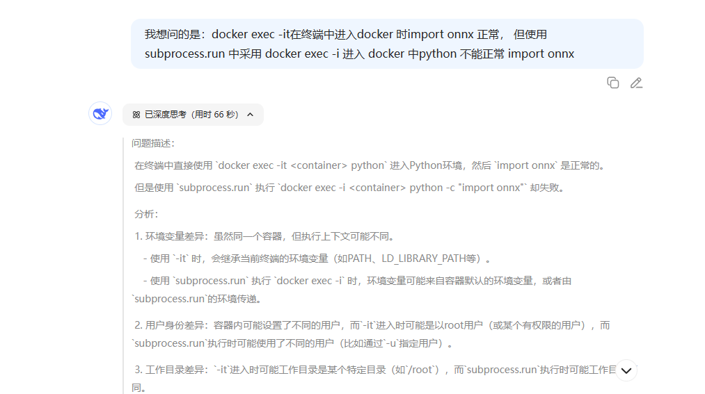
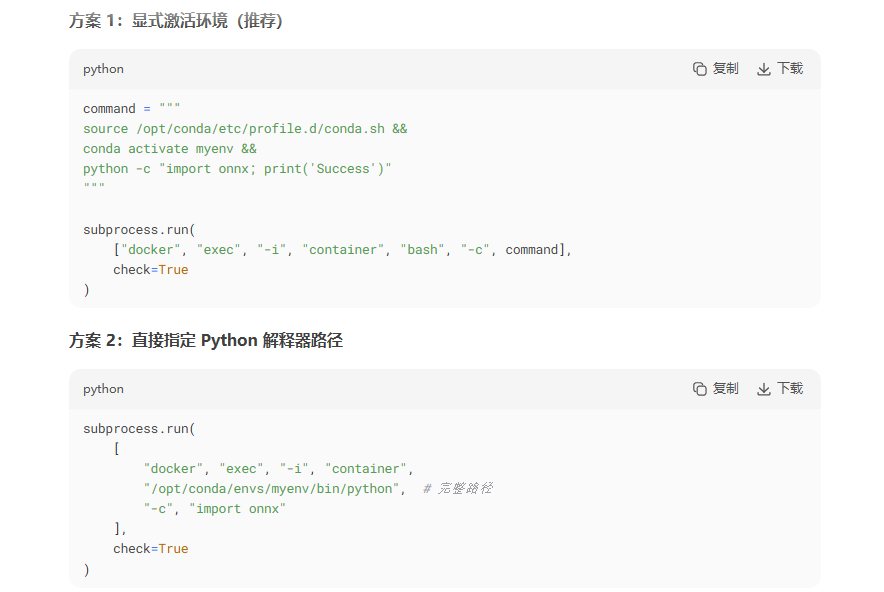
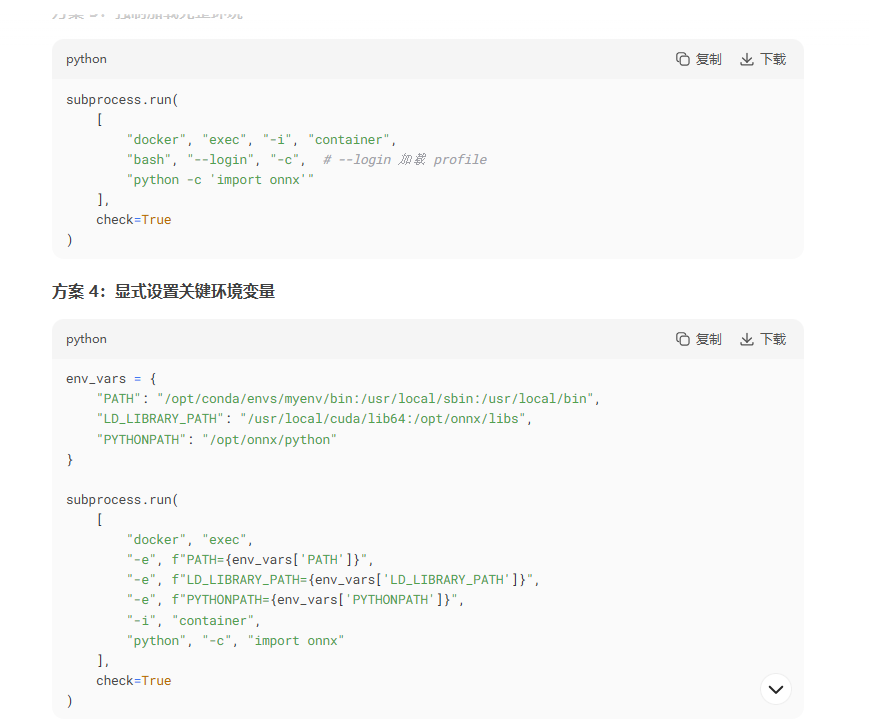
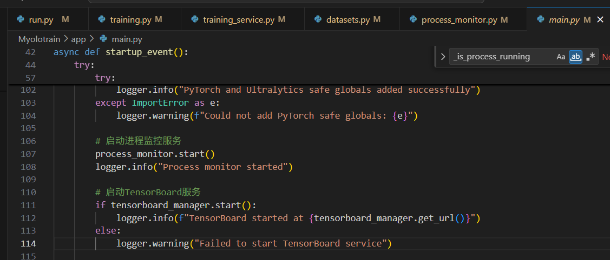
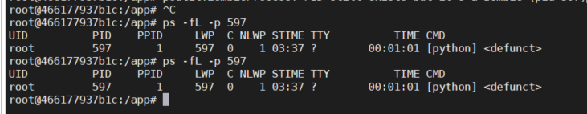
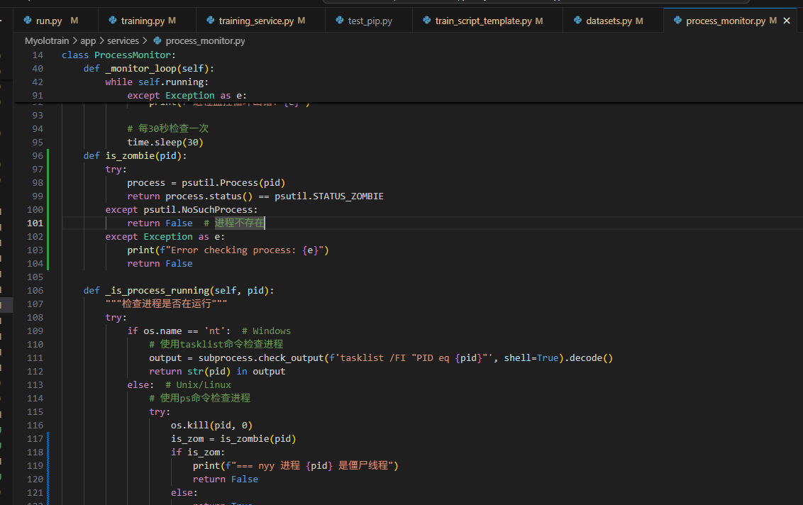

# Myolotrain-yolo 安装

#### Myolotrain-yolo 拉取

```
git clone https://gitee.com/rock_kim/Myolotrain.git
cd ./Myolotrain
```


#### Myolotrain-yolo 基础环境：pytorch环境 拉取  
在docker hub中： https://hub.docker.com/
使用 pytorch/pytorch:2.7.1-cuda11.8-cudnn9-devel 镜像
docker pull pytorch/pytorch:2.7.1-cuda11.8-cudnn9-devel

#### docker 配置说明 
在docker内安装需要的环境,
此部分可以在 Dockerfile.gpu中配置，也可在pytorch/pytorch:2.7.1-cuda11.8-cudnn9-devel安装并重新制作镜像

本文是在启动docker 在docker内部安装成功后，重新打包镜像myolotrain:v1

```
docker run --gpus all -e DISPLAY=unix$DISPLAY -v /tmp/.X11-unix:/tmp/.X11-unix -itd -v /home/nyy/:/workspace --shm-size 64g --name="yolotrainv1" -p 18000:8000 -p 16006:6006 pytorch/pytorch:2.7.1-cuda11.8-cudnn9-devel bash


pip install --no-cache-dir -r requirements.txt -i https://pypi.tuna.tsinghua.edu.cn/simple/
修改安装 opencv
pip install opencv-python-headless -i https://pypi.tuna.tsinghua.edu.cn/simple/

apt-get update && apt-get install -y \
    build-essential \
    libpq-dev \
    ffmpeg \
    libsm6 \
    libxext6 \
    && rm -rf /var/lib/apt/lists/*

docker commit 3c1ffdf592fa myolotrain:v1 # 保存为镜像images
docker save -o myolotrain_v1.tar.gz myolotrain:v1 # 镜像保存为压缩文件
```
####  Dockerfile.gpu 修改
为配合在 pytorch/pytorch:2.7.1-cuda11.8-cudnn9-devel 镜像基础上安装环境后的镜像myolotrain:v1，因此在Dockerfile.gpu修改如下：

```
# FROM nvidia/cuda:11.8.0-cudnn8-runtime-ubuntu22.04 --shm-size=64g
# pytorch/pytorch:2.7.1-cuda11.8-cudnn9-devel
FROM myolotrain:v2
# 避免交互式提示
ENV DEBIAN_FRONTEND=noninteractive

# 安装Python和系统依赖
# RUN apt-get update && apt-get install -y \
#     python3.10 \
#     python3.10-dev \
#     python3-pip \
#     build-essential \
#     libpq-dev \
#     ffmpeg \
#     libsm6 \
#     libxext6 \
#     && rm -rf /var/lib/apt/lists/*

# 创建Python符号链接
# RUN ln -s /usr/bin/python3.10 /usr/bin/python

# 设置工作目录
WORKDIR /app

# 复制依赖文件并安装
COPY requirements.txt .
# RUN pip3 install --no-cache-dir -r requirements.txt -i https://pypi.tuna.tsinghua.edu.cn/simple/

# 安装GPU版本的PyTorch
# RUN pip3 install torch torchvision torchaudio --index-url https://download.pytorch.org/whl/cu118

# 复制应用代码
COPY . .

# 创建必要的目录
RUN mkdir -p app/static/uploads app/static/datasets app/static/models app/static/results logs/tensorboard

# 暴露端口
EXPOSE 8000 6006

# 启动命令
CMD ["python", "run.py"]

```

#### docker-compose-gpu.yml 修改
为了把代码映射出来，添加路径映射：- ./:/app/
为了设置docker共享内存增加，设置：shm_size: '64gb
volumes:
      - ./:/app/
            - ./app/static:/app/app/static
            - ./logs:/app/logs
shm_size: '64gb

```
version: '3'

services:
  db:
    image: postgres:13
    environment:
      POSTGRES_USER: postgres
      POSTGRES_PASSWORD: postgres
      POSTGRES_DB: yolov8_platform
    volumes:
      - postgres_data:/var/lib/postgresql/data
    restart: always
  
  test:
    build:
      context: .
      dockerfile: Dockerfile.gpu
    ports:
      - "8000:8000"
      - "6006:6006"
    depends_on:
      - db
    environment:
      - POSTGRES_SERVER=db
      - POSTGRES_USER=postgres
      - POSTGRES_PASSWORD=postgres
      - POSTGRES_DB=yolov8_platform
      - NVIDIA_VISIBLE_DEVICES=all
    volumes:
      - ./:/app/
      - ./app/static:/app/app/static
      - ./logs:/app/logs
    shm_size: '64gb'
    # deploy:
    #   resources:
    #     limits:
    #       memory: 32G
    restart: always
    deploy:
      resources:
        reservations:
          devices:
            - driver: nvidia
              count: 4
              capabilities: [gpu]

volumes:
  postgres_data:
```
#### 构建并启动GPU版本容器
```
docker compose -f docker-compose-gpu.yml down -d
docker compose -f docker-compose-gpu.yml up -d

1、进入docker安装相关python库；
cd ./ultralytics-8.3.158  （此版本日志模块已经做特殊修改）
pip install -e . -i https://pypi.tuna.tsinghua.edu.cn/simple/

pip install onnx==1.13.0 -i https://pypi.tuna.tsinghua.edu.cn/simple/
pip install onnxslim==0.1.61 -i https://pypi.tuna.tsinghua.edu.cn/simple/
pip install onnxruntime -i https://pypi.tuna.tsinghua.edu.cn/simple/
pip install onnxruntime-gpu -i https://pypi.tuna.tsinghua.edu.cn/simple/

pip install numpy==1.26.4 -i https://pypi.tuna.tsinghua.edu.cn/simple
pip install Flask==2.2.5 -i https://pypi.tuna.tsinghua.edu.cn/simple

2、在docker内安装 docker.io
apt update
apt install net-tools
apt-get install -y docker.io
                     
```

#### 测试记录

```
yolo detect train data=/app/datasets_import/sitting_pose/dataset.yaml model=yolov8s.pt epochs=10 imgsz=640 device=0 workers=8 batch=16 verbose=False amp=False

# 准备训练参数
train_args = {{
    'data': dataset_yaml,
    'epochs': epochs,
    'batch': batch_size,
    'imgsz': img_size,
    'project': output_dir,
    'device': [0, 1, 2, 3],
    'name': 'exp',
    'exist_ok': True,
    'workers': 0,  # 禁用多进程数据加载，避免多进程问题
    'amp': False  # 禁用自动混合精度，避免下载额外模型
}}

yolo detect train data=/app/datasets_import/sitting_pose/dataset.yaml model=yolov8s.pt epochs=12 imgsz=640 device=0 workers=8 batch=16 save_period=10 amp=False
```


# Myolotrain-yolo 二次开发记录

#### 配置环境说明

1、整个程序涉及cvat相关多个docker，具体参考：[CVAT 安装指南](./CVAT_安装.md)

2、Myolotrain平台docker：myolotrain-web-1和myolotrain-db-1 具体参考此文档的上半部分

3、rk3588训练docker：yolo_rknn；

```
启动rknn yolov8训练环境
docker run --gpus all  -v /tmp/.X11-unix:/tmp/.X11-unix -itd -v /home/nyy/object-detect/Myolotrain:/app/ --shm-size 64g --name="yolo_rknn" myolotrain:v2 bash
cd ./ultralytics_yolov8-main
pip install -e . -i https://pypi.tuna.tsinghua.edu.cn/simple/
pip install onnx onnxslim onnxruntime onnxruntime-gpu -i https://pypi.tuna.tsinghua.edu.cn/simple/

pip install onnx -i https://pypi.tuna.tsinghua.edu.cn/simple/
pip install onnxslim -i https://pypi.tuna.tsinghua.edu.cn/simple/
pip install onnxruntime -i https://pypi.tuna.tsinghua.edu.cn/simple/
pip install onnxruntime-gpu -i https://pypi.tuna.tsinghua.edu.cn/simple/
```

4、超星训练docker：yolo_nova；

```
启动超星 yolov8训练环境
docker run --gpus all  -v /tmp/.X11-unix:/tmp/.X11-unix -itd -v /home/nyy/object-detect/Myolotrain:/app/ --shm-size 64g --name="yolo_nova" myolotrain:v2 bash
cp -r ultralytics-8.3.158 ultralytics-8.3.158-nova
cd ./ultralytics-8.3.158-nova
pip install -e . -i https://pypi.tuna.tsinghua.edu.cn/simple/
pip install onnx onnxslim onnxruntime onnxruntime-gpu -i https://pypi.tuna.tsinghua.edu.cn/simple/

pip install onnx -i https://pypi.tuna.tsinghua.edu.cn/simple/
pip install onnxslim -i https://pypi.tuna.tsinghua.edu.cn/simple/
pip install onnxruntime -i https://pypi.tuna.tsinghua.edu.cn/simple/
pip install onnxruntime-gpu -i https://pypi.tuna.tsinghua.edu.cn/simple/
```

5、BM1688模型转换docker：sophon_npu_model2；具体参考：[算能平台 安装指南](./yoloV8-onnx模型适配算能平台.md)

```
docker run --privileged --network host --name sophon_npu_model2 -v /var/run/docker.sock:/var/run/docker.sock -v /home/nyy:/home/nyy -dit sophgo/tpuc_dev:v3.3
pip install tpu_mlir[onnx] -i https://pypi.tuna.tsinghua.edu.cn/simple/
```

6、超星模型转换docker：nova_npu_model2；具体参考：[超星平台 安装指南](./yoloV8-onnx模型适配超星平台.md)

```
docker run --privileged --gpus all --network host --name nova_npu_model2 -v /var/run/docker.sock:/var/run/docker.sock -v /home/nyy:/home/nyy --shm-size 64g -dit ndk:v2.9.0-cuda11.3 /bin/bash
安装python环境
pip install opencv-python-headless==4.11.0.86 -i https://pypi.tuna.tsinghua.edu.cn/simple/

```

7、rk3588模型转换docker：rknn_model；具体参考：[RK3588平台 安装指南](./yoloV8-onnx模型适配RKNN平台.md)

```
cd  /home/nyy/rknn/rknn-toolkit2-v2.3.2-2025-04-09/rknn-toolkit2/docker/docker_file/ubuntu_20_04_cp38/
cp Dockerfile_ubuntu_20_04_for_cp38 dockerfile
docker build -t rknn_toolkit .
docker run --privileged --gpus all -e DISPLAY=unix$DISPLAY -v /tmp/.X11-unix:/tmp/.X11-unix -itd -v /home/nyy:/home/nyy --shm-size 64g --name="rknn_model"  rknn_toolkit:latest bash
docker run --privileged --gpus all -e DISPLAY=unix$DISPLAY -v /tmp/.X11-unix:/tmp/.X11-unix -itd -v /home/nyy:/home/nyy --shm-size 64g --name="rknn_model"  rknn_model:v1 bash

在 /home/nyy/rknn/yolov8/python/ 中放入convert_fp16.py 文件即可
```

convert_fp16.py

```python
import argparse
import sys
from rknn.api import RKNN
DATASET_PATH = '../../../datasets/COCO/coco_subset_20.txt'
DEFAULT_RKNN_PATH = '../model/yolov8.rknn'
DEFAULT_QUANT = True
def parse_arg():
    if len(sys.argv) < 3:
        print("Usage: python3 {} onnx_model_path [platform] [dtype(optional)] [output_rknn_path(optional)]".format(sys.argv[0]));
        print("       platform choose from [rk3562, rk3566, rk3568, rk3576, rk3588, rv1126b, rv1109, rv1126, rk1808]")
        print("       dtype choose from [i8, fp] for [rk3562, rk3566, rk3568, rk3576, rk3588, rv1126b]")
        print("       dtype choose from [u8, fp] for [rv1109, rv1126, rk1808]")
        exit(1)
    model_path = sys.argv[1]
    platform = sys.argv[2]

    do_quant = DEFAULT_QUANT
    if len(sys.argv) > 3:
        model_type = sys.argv[3]
        if model_type not in ['i8', 'u8', 'fp']:
            print("ERROR: Invalid model type: {}".format(model_type))
            exit(1)
        elif model_type in ['i8', 'u8']:
            do_quant = True
        else:
            do_quant = False

    if len(sys.argv) > 4:
        output_path = sys.argv[4]
    else:
        output_path = DEFAULT_RKNN_PATH

    return model_path, platform, do_quant, output_path

if __name__ == '__main__':
    parser = argparse.ArgumentParser(description='rk3588模型量化')
    parser.add_argument('-i', '--input', type=str, required=True, help='输入ONNX模型路径')
    parser.add_argument('-o', '--output', type=str, required=True, help='输出量化模型路径')
    args = parser.parse_args()
    input_onnx = args.input
    output_path = args.output
    print("===========input_onnx:",input_onnx)  

    # model_path, platform, do_quant, output_path = parse_arg()

    model_path = input_onnx
    platform = "rk3588"
    do_quant = False   #标志不支持int8量化
    output_path = output_path

    # Create RKNN object
    rknn = RKNN(verbose=False)

    # Pre-process config
    print('--> Config model')
    rknn.config(mean_values=[[0, 0, 0]], std_values=[
                    [255, 255, 255]], target_platform=platform)
    print('done')

    # Load model
    print('--> Loading model')
    ret = rknn.load_onnx(model=model_path)
    if ret != 0:
        print('Load model failed!')
        exit(ret)
    print('done')

    # Build model
    print('--> Building model')
    # ret = rknn.build(do_quantization=do_quant, dataset=DATASET_PATH)
    ret = rknn.build(do_quantization=do_quant)
    if ret != 0:
        print('Build model failed!')
        exit(ret)
    print('done')

    # Export rknn model
    print('--> Export rknn model')
    ret = rknn.export_rknn(output_path)
    if ret != 0:
        print('Export rknn model failed!')
        exit(ret)
    print('done')

    # Release
    rknn.release()

```


### docker内使用另外一个docker

```
1、主docker 启动时 在docker内部运行docker，要做的只是在默认Unix套接字docker.sock作为卷的情况下运行docker： 
-v /var/run/docker.sock:/var/run/docker.sock
示例：
docker run --privileged --gpus all --network host --name nova_npu_model2 -v /var/run/docker.sock:/var/run/docker.sock -v /home/nyy:/home/nyy --shm-size 64g -dit ndk:v2.9.0-cuda11.3 /bin/bash
2、在docker内安装 docker.io
apt update
apt install net-tools
apt-get install -y docker.io

```

#### 待使用docker内有python 虚拟环境时，使用其python环境时：

```
1、需要配置激活虚拟环境：如下
   "source /opt/conda/etc/profile.d/conda.sh",
    "conda activate base",
BUILD_CMDS_UINT8 = [
    "source /opt/conda/etc/profile.d/conda.sh",
    "conda activate base",
    "cd {CODE_PATH}",
    "touch BUILD_CMDS_UINT8.txt",
    "python /home/nyy/CX/model_transform/fusion_preprocess_uint_nm10.py \
        --input {input_model_name} \
        --output {output_model_name}",
    "touch nm.txt"
]
2、使用示例：
#2 模型uint8
code_path = "/home/nyy/CX/model_transform/"
cmds = [cmd.format(CODE_PATH=code_path, input_model_name=modified_model_file_root,output_model_name=modified_model_file_uint8) for cmd in BUILD_CMDS_UINT8]
full_cmd = " && ".join(cmds)

container = "nova_npu_model2"    
docker_cmd = [
    "docker", "exec","-i", container,
    "/bin/bash", "-c", full_cmd
]    
result = subprocess.run(docker_cmd, check=True)

```

#### python中运行命令行脚本：

```
1、示例：
model_path = nm10_model_output_file_myoloTrain + "output/qc/modified_model_uint8/compiler_output/"
tar_name = f"{path_dst}{name}_nm10.tar.gz"
# model_path_name = f"{model_path}nrt.*" 
model_path_name = os.path.join(model_path, "nrt.*")    
result = subprocess.run(
    f"tar -zcvf {tar_name} {model_path_name}",  # 单字符串命令
    shell=True,  # 启用shell解释通配符
    check=True,  # 检查命令是否成功
    # 可选：捕获输出用于调试
    # stdout=subprocess.PIPE,
    # stderr=subprocess.PIPE,
    # text=True
)
2、注意事项。通配符处理问题：

原代码使用列表形式 ["tar", "-zcvf", tar_name, model_path_name]
这会导致 nrt.* 作为字面字符串传递，不会被扩展为实际文件
解决方案：1）改用shell=True让shell解释通配符；2）f"tar -zcvf {tar_name} {model_path_name}"

```

#### deepseek 使用提问经验：

对问题需描述清晰，顺利解决问题







#### 训练状态无法更新

1、在/home/nyy/object-detect/Myolotrain/app/main.py 中的 服务刷新页面会调用此接口：@app.on_event("startup")

在接口中会启动监控进程服务：如下图；



在监控进程中会每隔30s，定期检查所有训练进程状态（是通过查看训练进程是否结束，结束后分析相应的日志是否有：completed），同时把状态信息写进数据库；

2、状态未更新的原因：使用subprocess.Popen训练进程出现 僵尸进程

**什么是僵尸进程？**

- **定义**：子进程已经结束运行，但其退出状态未被父进程读取（通过 `wait()` 或 `waitpid()`），导致内核仍保留该进程的 PID 和少量信息。
- **特点**：
  - 在进程列表（如 `ps`）中显示为 `<defunct>`。
  - 不占用 CPU/内存，但会占用 PID 资源。
  - 如果大量堆积，可能导致系统无法创建新进程。

使用ps -f -p 597 ：



代码处理：

```
import psutil
try:
    p = psutil.Process(597)
    print(p.cmdline())
except psutil.ZombieProcess:
    print("进程是僵尸，跳过处理")  # 或直接 pass
```

查看PID命令：

```
ps aux | grep defunct
ps -fL -p 597
```

3、解决方案：

判断进程是否是僵尸进程，如果是，则认为模型训练完成。开始分析日志是否有“completed” 标记，如果有则更新数据库状态：


