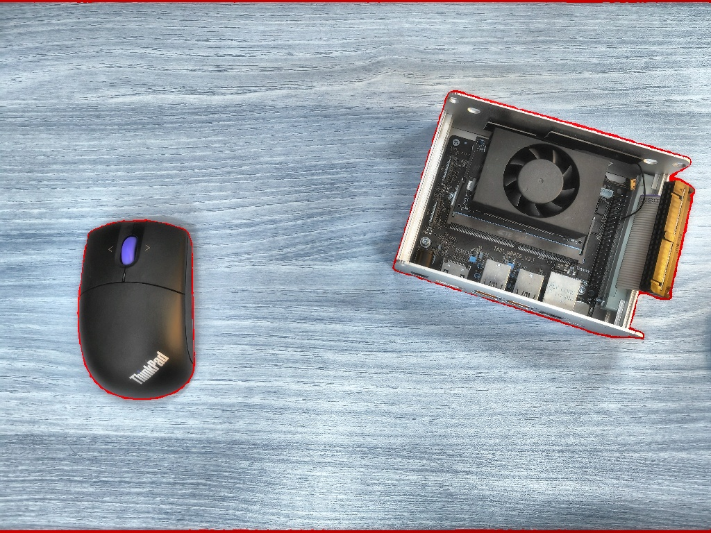

# SAM2 记录

## sam2-docker 安装记录


此版本具备一个完成的docker部署，并能够实现基于SAM2和SAM2.1的全分割和基于点的分割

[Dicom-Vision/SAM2-Docker: 👀 Segment Anything 2 + Docker 🐳](https://github.com/Dicom-Vision/SAM2-Docker)

```bash
docker pull peasant98/sam2:cuda-12.1

# mount this repo, which is assumed to be in the current directory
docker run -it -v /tmp/.X11-unix:/tmp/.X11-unix  -v `pwd`/SAM2-Docker:/home/user/SAM2-Docker -e DISPLAY=$DISPLAY --gpus all peasant98/sam2:cuda-12.1 bash

docker run -it -v /tmp/.X11-unix:/tmp/.X11-unix  -v /home/nyy/object-detect/SAM2-Docker:/home/user/SAM2-Docker -e DISPLAY=$DISPLAY --gpus all peasant98/sam2:cuda-12.1 bash
# in the container!
cd SAM2-Docker/
python3 examples/image_predictor.py

docker build -t sam2:v1 . 
docker compose -f docker-compose.yml up -d 


docker run -it --gpus all -e DISPLAY=$DISPLAY -v /tmp/.X11-unix:/tmp/.X11-unix  -v /home/nyy/object-detect/SAM2-Docker:/home/user/SAM2-Docker --shm-size 64g  --name sam2_nyy -p 5000:5000 --network host peasant98/sam2:cuda-12.1 bash
```

**创建共享网络**：

```py
docker network create my_network_sam
```

**启动后端**

```
docker run --gpus all --network=my_network_sam -v /tmp/.X11-unix:/tmp/.X11-unix -itd -v /home/nyy/object-detect/SAM2-Docker:/home/user/SAM2-Docker --shm-size 64g  --name='sam_app' -p 10006:10006 peasant98/sam2:cuda-12.1 bash

pip install flask imageio[ffmpeg] nibabel APScheduler gunicorn pydicom -i https://pypi.tuna.tsinghua.edu.cn/simple/

sudo apt-get install net-tools
```

**启动 Nginx 并加入同一网络**：

```
proxy_pass http://sam_app:10006;  # 通过Docker网络直接解析容器名

docker run -itd --name='sam_sever' -p 80:80 --network=my_network_sam -v /home/nyy/object-detect/SAM2-Docker/nginx.conf:/etc/nginx/conf.d/default.conf nginx:latest
```

## sam2-docker 总结

1、使用sam2-docker 最重要实现：peasant98/sam2:cuda-12.1（基于nvidia/cuda:12.1.0-devel-ubuntu20.04）构建环境SAM2环境（参考“启动后端”部分）。

2、尝试使用Nginx代理docker服务，具体步骤可参考以上流程

## 全分割分割代码：test_sam2.1.py

<details>
<summary>点击展开/折叠代码/test_sam2.1.py</summary>

```python
import numpy as np
import torch
from PIL import Image
import cv2
from sam2.build_sam import build_sam2
from sam2.automatic_mask_generator import SAM2AutomaticMaskGenerator
import time
 
# Enable CUDA optimizations
if torch.cuda.is_available():
    torch.autocast(device_type="cuda", dtype=torch.float16).__enter__()
 
    if torch.cuda.get_device_properties(0).major >= 8:
        torch.backends.cuda.matmul.allow_tf32 = True
        torch.backends.cudnn.allow_tf32 = True
 
def apply_color_mask(image, mask, color, color_dark=0.5):
    """Apply colored mask to the image."""
    for c in range(3):
        image[:, :, c] = np.where(mask == 1, image[:, :, c] * (1 - color_dark) + color_dark * color[c], image[:, :, c])
    return image
 
def init_sam(sam2_checkpoint = "checkpoints/sam2_hiera_large.pt", model_cfg = "sam2_hiera_l.yaml"):

    # Load SAM2 Model
    sam2 = build_sam2(model_cfg, sam2_checkpoint, device='cuda', apply_postprocessing=False)
    # sam2.to(device="cuda" if torch.cuda.is_available() else "cpu")
 
    # Initialize mask generator
    mask_generator = SAM2AutomaticMaskGenerator(
            sam2,
            points_per_side=32,  # 控制分割密度
            pred_iou_thresh=0.86,  # 过滤低质量分割
            stability_score_thresh=0.92,  # 过滤不稳定分割
            crop_n_layers=1,  # 使用裁剪层提高小物体检测
            crop_n_points_downscale_factor=2,
            min_mask_region_area=100  # 过滤小区域
        )
    # sam = sam_model_registry[model_type](checkpoint=model_path)
    # sam.to(device="cuda" if torch.cuda.is_available() else "cpu")
    # mask_generator = SamAutomaticMaskGenerator(
    #     sam,
    #     points_per_side=32,  # 控制分割密度
    #     pred_iou_thresh=0.86,  # 过滤低质量分割
    #     stability_score_thresh=0.92,  # 过滤不稳定分割
    #     crop_n_layers=1,  # 使用裁剪层提高小物体检测
    #     crop_n_points_downscale_factor=2,
    #     min_mask_region_area=100  # 过滤小区域
    # )
    return mask_generator


def preprocess_image(image_path, target_size=1024):
    image = cv2.imread(image_path)
    h, w = image.shape[:2]
    scale = target_size / max(h, w)
    image = cv2.resize(image, (int(w*scale), int(h*scale)))
    return image

def enhance_foreground(foreground, background_strength=0.2):
    """前景增强处理"""
    # 创建纯黑背景
    enhanced = foreground.copy()
    
    # 可选：给背景添加轻微的原图模糊（保持空间感）
    if background_strength > 0:
        background = cv2.GaussianBlur(foreground, (25, 25), 0)
        mask = (foreground.sum(axis=2) == 0).astype(np.uint8)
        enhanced = cv2.addWeighted(
            enhanced, 1, 
            background, background_strength, 
            0
        )
    
    # 增强前景对比度
    enhanced = cv2.cvtColor(enhanced, cv2.COLOR_BGR2LAB)
    l, a, b = cv2.split(enhanced)
    clahe = cv2.createCLAHE(clipLimit=2.0, tileGridSize=(8,8))
    l = clahe.apply(l)
    enhanced = cv2.merge((l, a, b))
    enhanced = cv2.cvtColor(enhanced, cv2.COLOR_LAB2BGR)
    
    return enhanced

def main(img_path,output_path):
    sam2_checkpoint = "checkpoints/sam2_hiera_large.pt"
    model_cfg = "sam2_hiera_l.yaml"

    image = preprocess_image(img_path)
    image = cv2.cvtColor(image, cv2.COLOR_BGR2RGB) 

    mask_generator = init_sam()
 
    # Generate masks
    start = time.time()
    start_time = time.perf_counter()
    masks = mask_generator.generate(image)
    print(f"sam2 infer: {time.time() - start:.3f}s")

    inference_time_ms = (time.perf_counter() - start_time) * 1000  # 转换为毫秒
    print(f"SAM 推理时间: {inference_time_ms:.2f} ms")
 
    # Apply masks and save result
    image_select = image.copy()
    for mask_info in masks:
        color = tuple(np.random.randint(0, 256, 3).tolist())
        selected_mask = mask_info['segmentation']
        image_select = apply_color_mask(image_select, selected_mask, color)
 
    cv2.imwrite(output_path, image_select)
    print(f"Result saved to {output_path}")
    
    # # 创建白色背景 (BGR格式)
    # foreground = np.zeros_like(image)
    # # foreground = np.full_like(image, [255, 255, 255])  # BGR白色
    
    # # 合并所有分割区域
    # for ann in masks:
    #     mask = ann['segmentation']
    #     # foreground[mask] = image[mask]  # 只保留前景区域
    #     for c in range(3):
    #         foreground[:,:,c][mask] = image[:,:,c][mask]

    # # 4. 前景增强
    # enhanced = enhance_foreground(foreground)

    # # 5. 保存结果
    # cv2.imwrite(output_path, enhanced)
    # print(f"结果已保存至 {output_path}")
    
if __name__ == "__main__":
    # main("img_375.jpg", "img_375_FG.jpg")
    # main("test_02.jpg", "../result/test_02_sam2_.jpg")
    main("test_01.jpg", "../result/test_01_sam2.jpg")
    # main("test_03.jpg", "test_03_FG.jpg")

```

</details>

## 全分割分割代码：test_sam2.py

<details>
<summary>点击展开/折叠代码/test_sam2.py</summary>


```python

import time
import numpy as np
import torch
import cv2
import matplotlib.pyplot as plt
from segment_anything import sam_model_registry, SamAutomaticMaskGenerator

def apply_color_mask(image, mask, color, color_dark=0.5):
    """Apply colored mask to the image."""
    for c in range(3):
        image[:, :, c] = np.where(mask == 1, image[:, :, c] * (1 - color_dark) + color_dark * color[c], image[:, :, c])
    return image
# 初始化模型
def init_sam(model_path="checkpoints/sam_vit_l_0b3195.pth", model_type="vit_l"):
    sam = sam_model_registry[model_type](checkpoint=model_path)
    sam.to(device="cuda" if torch.cuda.is_available() else "cpu")
    mask_generator = SamAutomaticMaskGenerator(
        sam,
        points_per_side=32,  # 控制分割密度
        pred_iou_thresh=0.86,  # 过滤低质量分割
        stability_score_thresh=0.92,  # 过滤不稳定分割
        crop_n_layers=1,  # 使用裁剪层提高小物体检测
        crop_n_points_downscale_factor=2,
        min_mask_region_area=100  # 过滤小区域
    )
    return mask_generator

def preprocess_image(image_path, target_size=1024):
    image = cv2.imread(image_path)
    h, w = image.shape[:2]
    scale = target_size / max(h, w)
    image = cv2.resize(image, (int(w*scale), int(h*scale)))
    return image

def enhance_foreground(foreground, background_strength=0.2):
    """前景增强处理"""
    # 创建纯黑背景
    enhanced = foreground.copy()
    
    # 可选：给背景添加轻微的原图模糊（保持空间感）
    if background_strength > 0:
        background = cv2.GaussianBlur(foreground, (25, 25), 0)
        mask = (foreground.sum(axis=2) == 0).astype(np.uint8)
        enhanced = cv2.addWeighted(
            enhanced, 1, 
            background, background_strength, 
            0
        )
    
    # 增强前景对比度
    enhanced = cv2.cvtColor(enhanced, cv2.COLOR_BGR2LAB)
    l, a, b = cv2.split(enhanced)
    clahe = cv2.createCLAHE(clipLimit=2.0, tileGridSize=(8,8))
    l = clahe.apply(l)
    enhanced = cv2.merge((l, a, b))
    enhanced = cv2.cvtColor(enhanced, cv2.COLOR_LAB2BGR)
    
    return enhanced


# 分割图像中的所有物体并保存前景
def segment_everything(image_path, output_path="FG.jpg"):
    # 读取图像
    # image = cv2.imread(image_path)
    image = preprocess_image(image_path)

    image = cv2.cvtColor(image, cv2.COLOR_BGR2RGB)
    
    
    # 生成掩码
    mask_generator = init_sam()
    start_time = time.perf_counter()

    masks = mask_generator.generate(image)

    inference_time_ms = (time.perf_counter() - start_time) * 1000  # 转换为毫秒
    print(f"SAM 推理时间: {inference_time_ms:.2f} ms")

    # Apply masks and save result
    image_select = image.copy()
    for mask_info in masks:
        color = tuple(np.random.randint(0, 256, 3).tolist())
        selected_mask = mask_info['segmentation']
        image_select = apply_color_mask(image_select, selected_mask, color)
 
    cv2.imwrite(output_path, image_select)
    print(f"Result saved to {output_path}")
    
    # 创建前景图像
    # foreground = np.zeros_like(image)
    # 创建白色背景 (BGR格式)
    # foreground = np.full_like(image, [0, 0, 255])  # BGR白色
    # # foreground = np.full_like(image, [255, 255, 255])  # BGR白色
    # foreground_1 = np.full_like(image, [255, 255, 255])  # BGR白色
    # foreground_2 = np.full_like(image, [255, 255, 255])  # BGR白色    
    
    # # 合并所有分割区域
    # for ann in masks:
    #     mask = ann['segmentation']
    #     # foreground[mask] = image[mask]  # 只保留前景区域
    #     for c in range(3):
    #         foreground[:,:,c][mask] = image[:,:,c][mask]

    # # 4. 前景增强
    # enhanced = enhance_foreground(foreground)

    # # 5. 保存结果
    # cv2.imwrite(output_path, enhanced)
    # print(f"结果已保存至 {output_path}")
    
    return masks

# 使用示例
segment_everything("test_01.jpg", "../result/test_01_FG_1.jpg")
# segment_everything("test_03.jpg", "test_03_FG.jpg")
```
</details>

### 图片分割结果：

<p align = "center"> 


</p>

### 视频视频结果：

[点击观看视频](./CVAT/people-sam2.mp4)

[点击观看视频](street_sam2.mp4)


<video width="320" height="240" controls>
    <source src="street_sam2.mp4" type="video/mp4">
  你的浏览器不支持 HTML5 视频标签。
</video>


<video src="people-sam2.mp4" autoplay="true" controls="controls" width="800" height="600">
</video>


# sam2 安装记录

[facebookresearch/sam2 at sam2.1](https://github.com/facebookresearch/sam2/tree/sam2.1)

视频

https://sam2.metademolab.com/demo

图片：

[Segment Anything | Meta AI](https://segment-anything.com/demo#)


