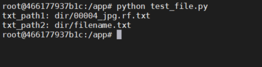
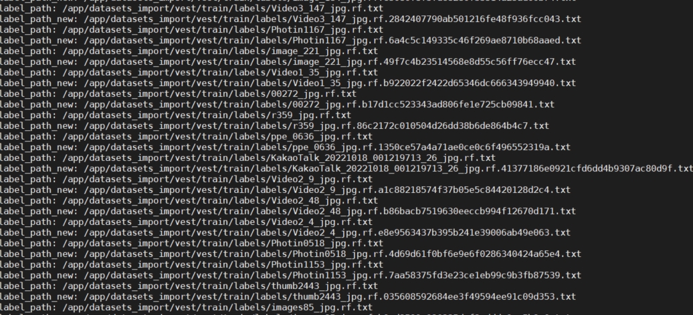

# python 开发问题记录

#### 针对此种格式的图像 “labels/00004_jpg.rf.2611f6ec8eeaa1e221071c701f7faee4.jpg” 在处理找对应txt文件时报错问题

原因：使用with_suffix(".txt") 无后缀添加正常，当有".2611f6ec8eeaa1e221071c701f7faee4" 时此方法会把".txt"原后缀，导致错误

```python
from pathlib import Path
# 原始路径（无后缀）
file_path = Path("dir/00004_jpg.rf.2611f6ec8eeaa1e221071c701f7faee4")  # 或 Path("dir") / "filename"
# 添加 .txt 后缀
txt_path = file_path.with_suffix(".txt")
print(f"txt_path1: {txt_path}")

file_path = Path("dir/filename")  # 或 Path("dir") / "filename"
# 添加 .txt 后缀
txt_path = file_path.with_suffix(".txt")
print(f"txt_path2: {txt_path}")
```

运行结果：



实际文件测试

```py
import os
import shutil
from pathlib import Path
image_extensions = [".jpg", ".jpeg", ".png", ".bmp", ".webp"]

# 获取所有图像文件
def get_image_files(directory):
    if not directory.exists():
        return []
    return [f for f in directory.glob("*.*")
            if f.is_file() and f.suffix.lower() in image_extensions]

IMPORT_DIR = Path("/app/datasets_import/")
train_images_dir = IMPORT_DIR / "vest/train/images"
os.makedirs(train_images_dir, exist_ok=True)
train_images = get_image_files(train_images_dir)

all_images = []
all_images.extend([(img, "train") for img in train_images])
temp_images_dir = Path("/app/datasets_import/")
for img_path, src_set in all_images:   
    # 复制标签到临时目录
    src_label_dir = img_path.parent.parent / "labels"
    label_path_new = src_label_dir / (img_path.stem + ".txt")
    label_path = (src_label_dir / img_path.stem).with_suffix(".txt")  
    print(f"label_path: {label_path} ")
    print(f"label_path_new: {label_path_new}")
```

运行结果：


