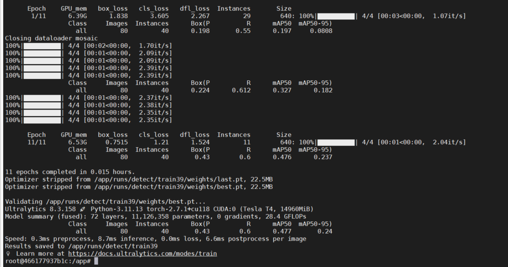
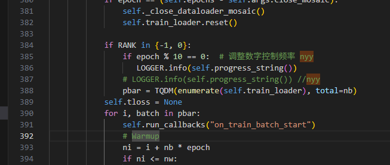
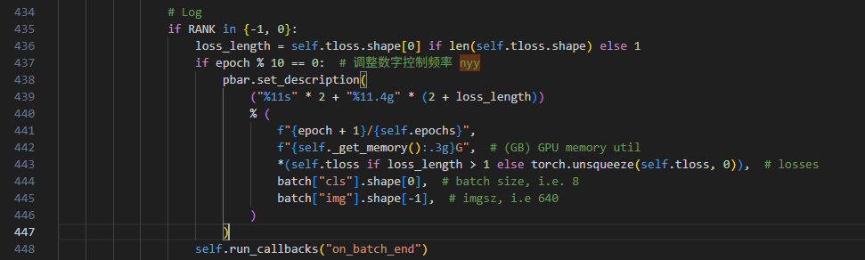
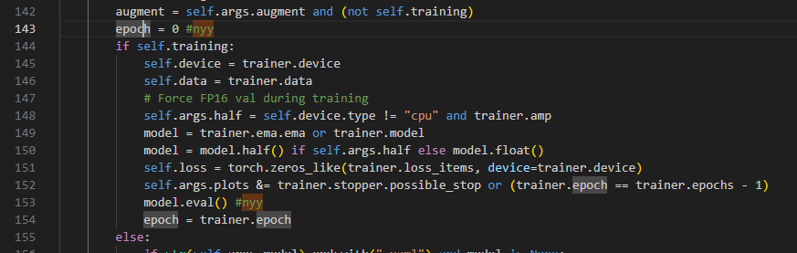
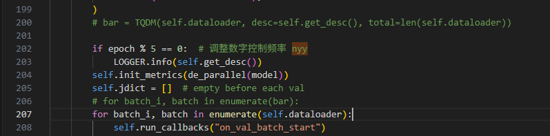
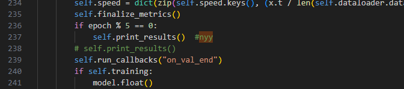

### docker 配置

```
docker run -e DISPLAY=unix$DISPLAY -v /tmp/.X11-unix:/tmp/.X11-unix -itd -v /home/nyy/object-detect/:/workspace  --name="torch" -p 10012:6006 pytorch/pytorch:1.13.1-cuda11.6-cudnn8-runtime /bin/bash 


docker run -e DISPLAY=unix$DISPLAY -v /tmp/.X11-unix:/tmp/.X11-unix -itd -v /home/nyy/object-detect/:/workspace --shm-size 64g --name="torch2" -p 10013:6006 pytorch/pytorch:1.13.1-cuda11.6-cudnn8-runtime bash

docker run -e DISPLAY=unix$DISPLAY -v /tmp/.X11-unix:/tmp/.X11-unix -itd -v /home/nyy/object-detect/:/workspace --shm-size 64g --name="torch2" -p 10012:6006 pytorch/pytorch:1.13.1-cuda11.6-cudnn8-runtime bash


docker run --gpus all -e DISPLAY=unix$DISPLAY -v /tmp/.X11-unix:/tmp/.X11-unix -itd -v /home/nyy/object-detect/:/workspace --shm-size 64g --name="torch" -p 10012:10006 pytorch/pytorch:1.13.1-cuda11.6-cudnn8-runtime bash

启动超星 yolov8训练环境
docker run --gpus all  -v /tmp/.X11-unix:/tmp/.X11-unix -itd -v /home/nyy/object-detect/Myolotrain:/app/ --shm-size 64g --name="yolo_nova" myolotrain:v2 bash

启动rknn yolov8训练环境
docker run --gpus all  -v /tmp/.X11-unix:/tmp/.X11-unix -itd -v /home/nyy/object-detect/Myolotrain:/app/ --shm-size 64g --name="yolo_rknn" myolotrain:v2 bash

```

### yolov8安装记录

```
unzip ultralytics-8.2.50.zip
cd ./ ultralytics-8.2.50
pip install -e . -i https://pypi.tuna.tsinghua.edu.cn/simple/

pip install onnx -i https://pypi.tuna.tsinghua.edu.cn/simple/
pip install onnxslim -i https://pypi.tuna.tsinghua.edu.cn/simple/
pip install onnxruntime -i https://pypi.tuna.tsinghua.edu.cn/simple/

cd ./ultralytics-8.3.121
pip install -e . -i https://pypi.tuna.tsinghua.edu.cn/simple/

pip install onnx -i https://pypi.tuna.tsinghua.edu.cn/simple/
pip install onnxslim -i https://pypi.tuna.tsinghua.edu.cn/simple/
pip install onnxruntime -i https://pypi.tuna.tsinghua.edu.cn/simple/
pip install onnxruntime-gpu -i https://pypi.tuna.tsinghua.edu.cn/simple/


pip install onnx_modifier -i https://pypi.tuna.tsinghua.edu.cn/simple/

pip install numpy==1.26.4 -i https://pypi.tuna.tsinghua.edu.cn/simple

超星训练，为提高推理速度，适配修改 Sigmoid激活函数更换为Relu激活函数：nn.SiLU() 更改为nn.ReLU()
具体位置：
./ultralytics-8.3.121/ultralytics/nn/modules/conv.py 中的 共3处
    # default_act = nn.SiLU()  # default activation
    default_act = nn.ReLU() 
./ultralytics-8.3.121/ultralytics/nn/modules/block.py 中的 共2处
   # self.act = nn.SiLU()
   self.act = nn.ReLU() # nyy
./ultralytics-8.3.121/ultralytics/utils/torch_utils.py 中的 共1处
   # elif t in {nn.Hardswish, nn.LeakyReLU, nn.ReLU, nn.ReLU6, nn.SiLU}:
   elif t in {nn.Hardswish, nn.LeakyReLU, nn.ReLU, nn.ReLU6, nn.ReLU}:
```

#### 问题记录解决

```
RuntimeError: unable to write to file </torch_1355_3139633836_0>: No space left on device (28)
ERROR: Unexpected bus error encountered in worker. This might be caused by insufficient shared memory (shm).
docker内共享内存太小。启动docker时指定共享内存大小
--shm-size 32g

ImportError: libGL.so.1: cannot open shared object file: No such file or directory 问题解决

pip install opencv-python-headless -i https://pypi.tuna.tsinghua.edu.cn/simple/
或者
# Ubuntu/Debian ：
sudo apt-get update
sudo apt-get install -y libgl1-mesa-glx  # 或简化为 libgl1

```

#### yolov8 train
```
yolo detect train data=/workspace/data/Helmet_YOLO/dataset.yaml model=yolov8s.pt epochs=100 imgsz=640 device=0 workers=8 batch=24 amp=False 

yolo detect train data=/workspace/data/Helmet_YOLO_nyy/dataset.yaml model=yolov8s.pt epochs=150 imgsz=640 device=0 workers=8 batch=16 amp=False 
yolo detect train data=/workspace/data/Helmet_YOLO_nyy/dataset.yaml model=yolov8s.pt epochs=150 imgsz=640 device=0 workers=8 batch=16 device=[0,1] amp=False 

yolo detect train data=/workspace/data/Helmet_YOLO/dataset.yaml model=yolov8m.pt epochs=100 imgsz=640 device=0 workers=8 batch=16 amp=False 

yolo detect train data=/dev/shm/python/data/voc_model2/model2_box.yaml model=yolov8m.pt epochs=30 imgsz=640 device=0 workers=8 batch=16 amp=False
yolo detect train data=/dev/shm/python/data/voc_ZX/ZX_box.yaml model=yolov8m.pt epochs=50 imgsz=640 device=0 workers=8 batch=16  amp=False

yolo detect train data=/workspace/data/Helmet_YOLO_nyy/dataset.yaml model=yolo11s.pt epochs=150 imgsz=640 device=0 workers=8 batch=16 amp=False
yolo detect train data=/workspace/data/Helmet_YOLO_nyy/dataset.yaml model=yolo11s.pt epochs=150 imgsz=640 device=0 workers=16 batch=32 dfl=2.5 device=[0,1,2,3] amp=False 
yolo detect train data=/workspace/data/Helmet_YOLO_nyy/dataset.yaml model=yolo11s.pt epochs=150 imgsz=640 device=0 workers=32 batch=64 dfl=2.5 device=[0,1,2,3] amp=False 

yolo detect train data=/workspace/data/Helmet_YOLO_nyy/dataset.yaml model=yolo11s.pt epochs=150 imgsz=640 device=0 workers=8 batch=16 amp=False

yolo detect train data=/app/datasets_import/car/dataset.yaml model=yolov8n.pt epochs=150 imgsz=640 device=0 workers=8 batch=16 amp=False loggers=tensorboard

yolo train data=/app/datasets_import/car/dataset.yaml model=yolov8n.pt epochs=10 lr0=0.01 loggers=tensorboard

/app/datasets_import/car


yolo segment train data=/dev/shm/python/data/train_seg/seg_box.yaml model=yolov8s-seg.pt epochs=50 imgsz=640 device=0 workers=8 batch=16 overlap_mask=False amp=False 
yolo task=segment mode=train model=/yolov8s-seg.pt data=/dev/shm/python/data/train_seg/seg_box.yaml epochs=100 imgsz=640 amp=False device=0 workers=8 batch=16

yolo segment train data=/dev/shm/python/data/lcq_seg_img/lcq_seg_box.yaml model=yolov8s-seg.pt epochs=50 imgsz=640 device=0 workers=8 batch=32 overlap_mask=False  amp=False 
yolo task=segment mode=train model=/yolov8s-seg.pt data=/dev/shm/python/data/lcq_seg_img/lcq_seg_box.yaml epochs=100 imgsz=640 amp=False device=0 workers=8 batch=16

nohup ./train_firesmoke_v8s.sh > train_firesmoke_v8s.txt 2>&1 &
nohup ./train_smoke_v8s.sh > train_smoke_v8s.txt 2>&1 &
nohup ./train_Helmet_parm_v11s.sh > train_Helmet_parm_v11s.txt 2>&1 &
nohup ./train_firesmoke_v8m.sh > train_firesmoke_v8m.txt 2>&1 &


yolo detect train data=/app/datasets_import/sitting_pose/dataset.yaml model=yolov8s.pt epochs=10 imgsz=640 device=0 workers=8 batch=16 amp=False 
```
### test
```bash
yolo task=detect mode=predict model=./yolov8s.pt image=./bus.jpg --imgsz=640


yolo task=detect mode=predict model=./runs/detect/sleep_v8s/weights/best.pt source=/workspace/data/sleep/test save=true

yolo task=detect mode=predict model=./runs/detect/fall_v8s/weights/best.pt source=/workspace/data/fall/test/images save=true

yolo task=detect mode=predict model=./runs/detect/firesmoke_CX_v8s/weights/best.pt source=/workspace/data/firesmoke/test save=true

yolo task=detect mode=predict model=./runs/detect/person_car_0712_v8s/weights/best.pt source=/workspace/data/person_car_0712/images save=true

yolo task=detect mode=predict model=./runs/detect/person_car_0712_v8s/weights/best.pt source=/workspace/data/person_car_0712/test save=true


yolo task=detect mode=predict model=./yolov8s.pt source=/workspace/data/Helmet/Helmet_EB save=true
yolo task=detect mode=predict model=./yolov8n.pt source=./test save=true

yolo task=detect mode=predict model=/app/app/static/models/training_8e5fe728-7d49-419c-bb45-fd9a29a341b6/exp/weights/best.pt source='/app/video/shopping_01.mp4'
```


### export

```
官方onnx模型导出：
yolo export model=./runs/detect/fall_v8s/weights/best.pt format=onnx dynamic=True simplify=true
yolo export model=/app/app/static/models/training_e9214eb4-b691-4e12-85ec-94acc9d7b9e0/exp/weights/best.pt format=onnx dynamic=True simplify=true

超星适配ONNX 导出：
python3 export.py

python3 export.py

from ultralytics import YOLO
# Load a model
model = YOLO('yolov8s.pt')  # load an official model  
# Export the model
model.export(format='onnx', imgsz=[640, 640], opset=11) # 导出一定不要修改这里参数
rknn适配ONNX 导出：
yolo export model=./runs/detect/train6/weights/best.pt format=rknn
yolo export model=/app/app/static/models/training_8bf47bcb-2b2c-4ed7-9294-221ffcf17441/exp/weights/best.pt format=rknn
```

### docker内安装 cuda驱动

```
docker run --gpus all --privileged --name test_tpu -v /home/nyy:/home/nyy -dit sophgo/tpuc_dev:v3.3
cat /etc/os-release
cuda历史版本
https://developer.nvidia.com/cuda-toolkit-archive
```

### yolov8修改日志保存（Ultralytics YOLOv8.3.158）

目的是减少终端输出日志打印；效果如下：



训练代码修改2处：

1、 /home/nyy/object-detect/Myolotrain/ultralytics-8.3.158/ultralytics/engine/trainer.py 的385行修改



```
if RANK in {-1, 0}:
    if epoch % 10 == 0:  # 调整数字控制频率 nyy
       LOGGER.info(self.progress_string())
    # LOGGER.info(self.progress_string()) //nyy
    pbar = TQDM(enumerate(self.train_loader), total=nb)
```

**以上方法修改后，训练中通过epoch % 10 可以控制日志打印，但每轮训练还是有进度条，**如下修改可以删除进度条：

1）禁用 pbar = TQDM(enumerate(self.train_loader), total=nb)

2）pbar.set_description 修改为print 打印日志

```

```

2、 /home/nyy/object-detect/Myolotrain/ultralytics-8.3.158/ultralytics/engine/trainer.py 的437行修改



```
if epoch % 10 == 0:  # 调整数字控制频率 nyy
    pbar.set_description(
        ("%11s" * 2 + "%11.4g" * (2 + loss_length))
        % (
            f"{epoch + 1}/{self.epochs}",
            f"{self._get_memory():.3g}G",  # (GB) GPU memory util
            *(self.tloss if loss_length > 1 else torch.unsqueeze(self.tloss, 0)),  # losses
            batch["cls"].shape[0],  # batch size, i.e. 8
            batch["img"].shape[-1],  # imgsz, i.e 640
        )
    )
```

验证代码修改3处：

1 、/home/nyy/object-detect/Myolotrain/ultralytics-8.3.158/ultralytics/engine/validator.py 中142 行 添加epoch = 0  用于控制打印



```
epoch = 0 #nyy
if self.training:
    self.device = trainer.device
    self.data = trainer.data            
    # Force FP16 val during training
    self.args.half = self.device.type != "cpu" and trainer.amp
    model = trainer.ema.ema or trainer.model
    model = model.half() if self.args.half else model.float()
    self.loss = torch.zeros_like(trainer.loss_items, device=trainer.device)
    self.args.plots &= trainer.stopper.possible_stop or (trainer.epoch == trainer.epochs - 1)
    model.eval() #nyy
    epoch = trainer.epoch   
```

2 、/home/nyy/object-detect/Myolotrain/ultralytics-8.3.158/ultralytics/engine/validator.py 中200行 



删除 bar = TQDM(self.dataloader, desc=self.get_desc(), total=len(self.dataloader)) （TQDM是用于显示进度条）

使用  for batch_i, batch in enumerate(self.dataloader):  控制循环

```
# bar = TQDM(self.dataloader, desc=self.get_desc(), total=len(self.dataloader))

if epoch % 5 == 0:  # 调整数字控制频率 nyy
    LOGGER.info(self.get_desc())        
self.init_metrics(de_parallel(model))
self.jdict = []  # empty before each val  
# for batch_i, batch in enumerate(bar):    
for batch_i, batch in enumerate(self.dataloader):
```

3 、/home/nyy/object-detect/Myolotrain/ultralytics-8.3.158/ultralytics/engine/validator.py 中237行 



```
        if epoch % 5 == 0: 
            self.print_results()  #nyy
        # self.print_results()
```

