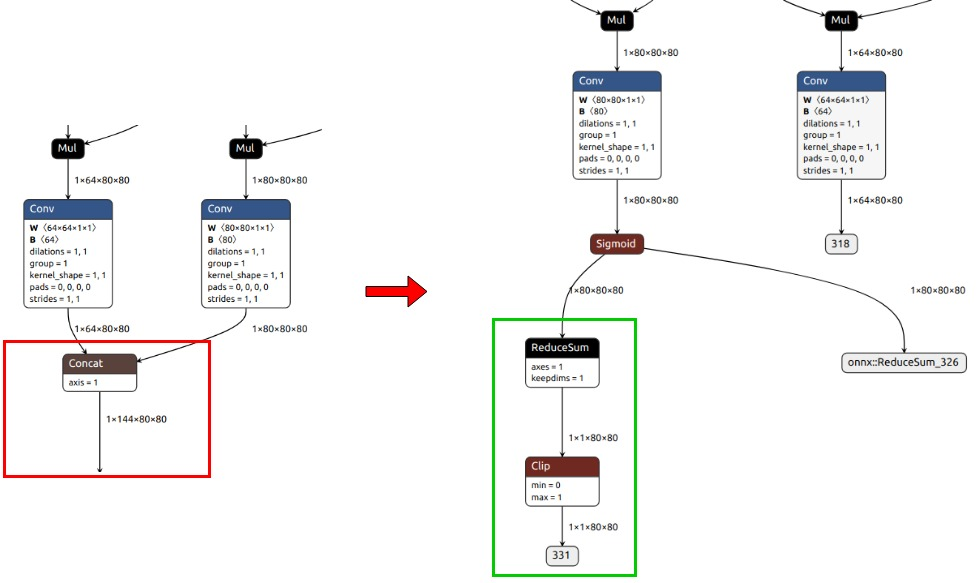
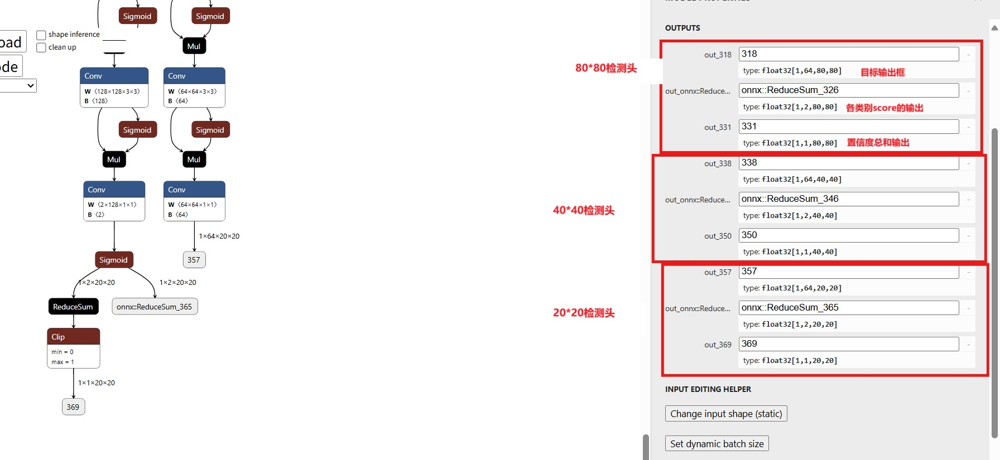
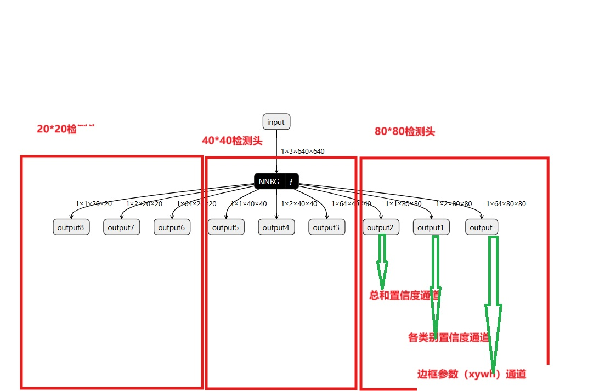

# rknn yolov8 模型转换及量化 环境 

完成yolov8的训练到部署转换需要用到下述三个仓库，链接如下： 

1.ultralytics_yolov8：https://github.com/airockchip/ultralytics_yolov8 

2.rknn_model_zoo：https://github.com/airockchip/rknn_model_zoo 

3.rknn-toolkit2：https://github.com/airockchip/rknn-toolkit2

# rk3588-yolov8训练代码

yolov8的官方训练模型代码，训练的模型无法在rk3588量化及部署。原因：

ultralytics_yolov8相较ultralytics做以下改动：

1、修改输出结构，移除后处理结构（后处理结构对量化不友好）（但是量化后得到的score往往集中在几个固定的值，这也是量化的缺陷之一，但是速度会快很多）

2、 dfl结构在NPU处理上性能不佳，移至模型外部的后处理阶段，此操作大部分情况下可提升推理性能。

3、模型输出分支新增置信度的总和，用于后处理阶段加速阈值筛选。

注：以上移除的操作，均需要在外部使用CPU进行相应的处理.（对应的后处理代码可以在rknn_model_zoo中找到）

rk3588官方代码：ultralytics_yolov8：https://github.com/airockchip/ultralytics_yolov8


其训练环境搭建与官方差比不大，可参 pytorch-yolov8.md

如果为了，获取更快的推理速度，可修改激活函数为nn.ReLU()：

把ultralytics/nn/modules/conv.py中的Conv类进行修改，将default_act = nn.SiLU() # default activation改为

default_act = nn.ReLU() # default activation 

# pt-onnx模型

在终端执行命令：yolo export model=yolov8relupt.pt format=rknn

或者python执行

```Plain
from ultralytics import YOLO
model = YOLO(model_path)  # 替换为你的模型路径
result_export = model.export(format='rknn') 
```





上图的三个红色方框非常重要，YOLOv8在RKNN转换过程中，是要有三个分支的，分别80×80检测头，40×40检测头，20×20检测头。每个检测头下，都有三个输出，分别是box边框输出，即图上的1×64×80×80；还有各类别输出，即1×2×80×80（这里的4就是指我在PT模型训练时的数据类的定义了2个类别），最后是综合置信度输出，即1×1×80×80。

# ONNX---rknn（yolov8 模型转换）

下载：rknn_model_zoo和rknn-toolkit2

- You can also download all packages, docker image, examples, docs and platform-tools from [RKNPU2_SDK](https://console.zbox.filez.com/l/I00fc3), fetch code: rknn

#### 模型转换及量化 环境

下载：rknn_model_zoo和rknn-toolkit2

- You can also download all packages, docker image, examples, docs and platform-tools from [RKNPU2_SDK](https://console.zbox.filez.com/l/I00fc3), fetch code: rknn

```
https://meta.zbox.filez.com/v/link/view/ef37a9687973439f94f5b06837f12527
```

## 构建并启动docker（模型转换量化环境）

进入 /home/nyy/rknn/rknn-toolkit2-v2.3.2-2025-04-09/rknn-toolkit2/docker/docker_file/ubuntu_20_04_cp38/ 中根据Dockerfile_ubuntu_20_04_for_cp38 dockerfile构建docker

```Plain
cp Dockerfile_ubuntu_20_04_for_cp38 dockerfile
docker build -t rknn_toolkit .
docker run --privileged --gpus all -e DISPLAY=unix$DISPLAY -v /tmp/.X11-unix:/tmp/.X11-unix -itd -v /home/nyy:/home/nyy --shm-size 64g --name="rknn_model"  rknn_toolkit:latest bash
```

#### rknn模型量化

进入/home/nyy/rknn/rknn_model_zoo-v2.3.2-2025-04-09/examples/yolov8/中

```Plain
cd python
python convert.py <onnx_model> <TARGET_PLATFORM> <dtype(optional)> <output_rknn_path(optional)>

# such as: 
python convert.py ../model/yolov8n.onnx rk3588 fp
# output model will be saved as ../model/yolov8.rknn
```

#### 用netron打开我们的rknn模型，看一下结构：



这三个红框是和上面图中的三个红框对应的，所以若onnx没有所示的那三个框，则无法转换出适配官方部署文件的rknn模型。
