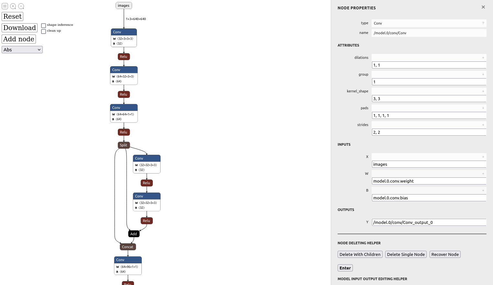
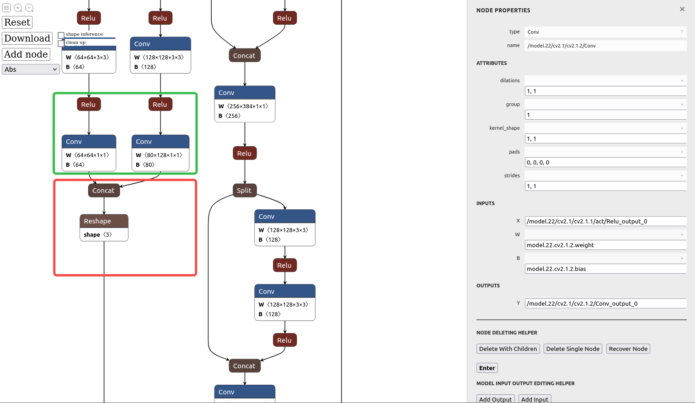
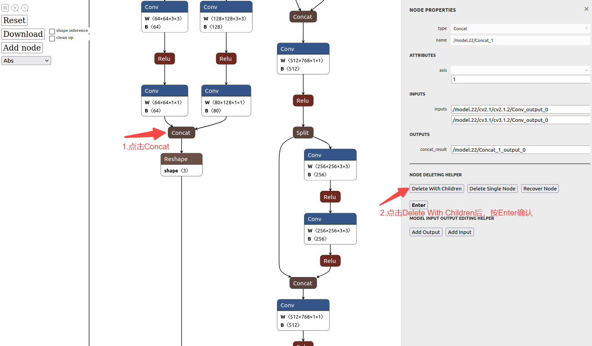
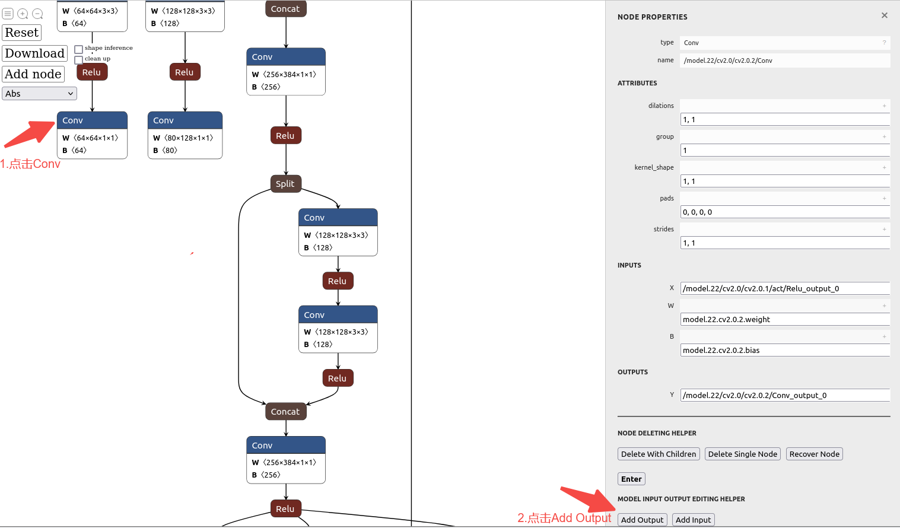
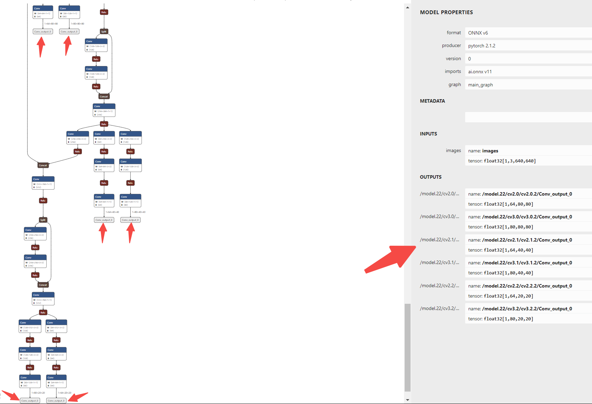

# 超星 yolov8 模型转换及量化 环境 

```
启动docker
docker run --gpus all -e DISPLAY=unix$DISPLAY -v /tmp/.X11-unix:/tmp/.X11-unix -itd -v /home/nyy:/home/nyy --shm-size 64g --name="nova_npu_nyy"  ndk:v2.9.0-cuda11.3 bash

docker run --privileged --gpus all --network host --name nova_npu_model2 -v /var/run/docker.sock:/var/run/docker.sock -v /home/nyy:/home/nyy --shm-size 64g -dit ndk:v2.9.0-cuda11.3 /bin/bash
安装python环境
pip install opencv-python-headless==4.11.0.86 -i https://pypi.tuna.tsinghua.edu.cn/simple/

export LD_LIBRARY_PATH=/home/nyy/CX/model_transform:$LD_LIBRARY_PATH
pip install opencv-python-headless seaborn scipy onnx-graphsurgeon flask threadpoolctl -i https://pypi.tuna.tsinghua.edu.cn/simple/
```

# 超星模型剪枝： 裁剪onnx

使用开源的onnx修改工具“[onnx-modifier](https://github.com/ZhangGe6/onnx-modifier.git)”对onnx模型进行裁剪

```
cd onnx-modifier
python/python3 app.py
#默认端口为5000，如有需要可自行修改端口
#python app.py --port xxxx

cd onnx-modifier
python entry.py

#如文件损环可使用以下命令重新下载
#git clone https://github.com/ZhangGe6/onnx-modifier.git
```

在浏览器中输入提示的local地址：http://127.0.0.1:5000

点击Open Model功能键选取需要裁剪的onnx模型，打开后的初始界面如下图所示


将onnx拉到最下方，可以看到后处理部分如下图红色区域所示，该部分是我们不想要的，绿色部分是六个尺度的特征图结果


如下图所示点击Concat(reshape)函数算子并删除其子节点（三个Concat均需按此操作）


接着点击这三个卷积层添加一个output节点，然后点击enter，最后点击download，会将修改后模型存在modified_onnx目录中。


修改后模型对应的OUTPUTS，如下图


删除后节点可能移动，根据编号找到Concat上面的conv

选中conv，分别点击add output添加输出

检查输出顺序，输出顺序由添加的顺序决定，确保输出尺寸从大到小

点击左上角download，模型在modified_onnx目录下保存为modified_yolov8s_640_640_3.onnx

裁剪后将裁剪后模型移入sampleYOLOV8文件夹

# 超星 模型转换、量化

融合前处理将输入层float32改为uint8一个可选操作，将模型从float32输入改为uint8可以去掉模型输入层的量化过程，以达到模型最高运行效率

在当前目录下生成modified_yolov8s_640_640_3_uint8.onnx模型文件

在fusion_preprocess_uint.py中修改配置文件为当前模型

```
if __name__ == '__main__':
    fusing_preprocess2onnx('modified_yolov8s_personcar.onnx',
                           'modified_yolov8s_personcar_uint8.onnx',
                           mean=[0, 0, 0],
                           scale=1 / 255.0)

python fusion_preprocess_uint.py
```

将onnx模型、export_yolov8s_uint8NDK.py代码和量化需要用到的图片放到sampleYOLOV8文件夹内，

在export_yolov8s_uint8NDK.py 中修改为当前的模型及量化图片

```
#进行量化编译
case_name = "modified_yolov8s_personcar_uint8"

# onnx_model_name = "onnx_models/modified_yolov8s_640_640_3_uint8.onnx"
onnx_model_name = "modified_yolov8s_personcar_uint8.onnx"
test_size = [640, 640] # w, h

output_path = "output/"
os.makedirs(output_path, exist_ok=True)
quant_output = os.path.join(output_path, "ir_output")
compiler_output = os.path.join(output_path, "compiler_output")
work_dir = os.path.join(output_path, "output/qc/" + case_name)
#image_path = "images"
# image_path = "/workspace/samples/datasets/coco128/images/train2017"
#image_path = "/home/nyy/CX/sample_yolov8_v2.9.0/datasets/smokephone/images/train2017"
image_path = "/home/nyy/CX/sample_yolov8_v2.9.0/datasets/personcar_CX/images/train2017"


python export_yolov8s_uint8NDK.py
```

## 超星 yolov8 测试编译环境 docker
```
docker run --privileged --name nova_build_nyy -v /home/nyy:/home/nyy -dit nova-build:v2.2.0
docker run --privileged --name nova_build_nyy -v /home/niuyuanye:/home/niuyuanye -dit nova-build:v2.2.0
dpkg -l | grep gcc
```
### cpp demo 测试
git 下载 sophon-demo示例 https://github.com/sophgo/sophon-demo.git
编译soc版本；主要依赖libsophon、sophon-opencv和sophon-ffmpeg运行库包
```
cd /sophon-demo-0.3.0/sample/YOLOv8_plus_det

cd cpp/yolov8_bmcv
mkdir build && cd build
#请根据实际情况修改-DSDK的路径，需使用绝对路径。
cmake -DTARGET_ARCH=soc -DSDK=/path_to_sdk/soc-sdk ..  
make -j33
```
### soc-sdk
```

export LD_LIBRARY_PATH=/data/home/admin/Deploy/nrt_v2.9.0/lib:${LD_LIBRARY_PATH}


```

#### 板卡测试
把编译的 yolov8_bmcv.soc文件下载到bm1688中， 图片测试实例如下：
```
sudo -i
export LD_LIBRARY_PATH=$LD_LIBRARY_PATH:/data/bm1688-cubeai/rules/common/


先通过web网页配置1个任务，视频源，算法任选；
手动docker rm -f 删除web启动的docker容器
taskmaster修改：
手动启动bm1688-taskmaster会创建/task/config/sys.yaml
修改/task/config/sys.yaml->task->url为真实要测试的视频流地址
修改/task/config/sys.yaml->algorithm->name为待调试的算法名称
algorithm修改
先手动启动一次bm1688-algorithm
创建/algorithm/models/目录，将你的算法模型文件拷贝到此目录
修改/algorithm/config/sys.yaml->model->paths: 为真实模型绝对路径
修改/algorithm/config/sys.yaml->algorithm->name为真实算法名称
修改/algorithm/config/sys.yaml->algorithm->classname为真实算法类别
再次重新启动taskmaster和algorithm，即可通过web任务预览查看效果

```
#### 测试图片
把编译的 yolov8_bmcv.soc文件下载到bm1688中， 图片测试实例如下：
```
./yolov8_run_model --bmodel=./models/modified_yolov8s_personcar/nrt.param  --bmodel_bin=./models/modified_yolov8s_personcar/nrt.bin --classnames=./datasets/personcar.names --input=./datasets/person_car/test --output=./datasets/person_car/personcar_result/

./yolov8_run_model --bmodel=./models/modified_yolov8s_personcar_384_640/nrt.param  --bmodel_bin=./models/modified_yolov8s_personcar_384_640/nrt.bin --classnames=./datasets/personcar.names --input=./datasets/person_car/test --output=./datasets/person_car/personcar_result/

./yolov8_run_model --bmodel=./models/modified_yolov8s_personcar_320_640/nrt.param  --bmodel_bin=./models/modified_yolov8s_personcar_320_640/nrt.bin --classnames=./datasets/personcar.names --input=./datasets/person_car/test --output=./datasets/person_car/personcar_result/

./yolov8_run_model --bmodel=./models/modified_firesmoke_yolov8s/nrt.param  --bmodel_bin=./models/modified_firesmoke_yolov8s/nrt.bin --classnames=./datasets/firesmoke.names --input=./datasets/firesmoke/test

./yolov8_run_model --bmodel=./models/modified_helmet_yolov8s/nrt.param  --bmodel_bin=./models/modified_helmet_yolov8s/nrt.bin --classnames=./datasets/helmet.names --input=./datasets/firesmoke/test


./yolov8_run_model --bmodel=./models/modified_smokephone_yolov8s/nrt.param  --bmodel_bin=./models/modified_smokephone_yolov8s/nrt.bin --classnames=./datasets/firesmoke.names --input=./datasets/firesmoke/test


docker run --privileged --name sophon_npu -v /home/nyy:/home/nyy -dit sophgo/tpuc_dev:v3.3

sudo docker run --privileged --name v8 -v /home/admin:/home/admin -dit sophon1688-smokedetect:cubeai-algorithm-v0.1
sudo docker run --privileged --name v8 -v /home/admin:/home/admin -dit sophon1688-smokedetect:cubeai-algorithm-v0.1

sudo docker run --privileged --name sophon_build -v /home/admin:/home/nyy -dit stream_dev:0.2


ffmpeg -r 30 -i " ./input.mp4" -r 1 "./Helmet/frame_%04d.jpg"

ffmpeg -r 30 -i "./constructionSite_265.mp4" -f image2 -strftime 1 ./Helmet/Helmet_%s.jpg


ffmpeg -r 25 -i "./traffic_flow_264.mp4" -f image2 -strftime 1 ./car/car_%s.jpg
ffmpeg -r 25 -i "./sh_street_01_264.mp4" -f image2 -strftime 1 ./car/car_sh_%s.jpg
ffmpeg -r 30 -i "./people_flow_264.mp4" -f image2 -strftime 1 ./car/people_%s.jpg
ffmpeg -r 30 -i "./person_264.mp4" -f image2 -strftime 1 ./car/person_%s.jpg

ffmpeg -r 20 -i "./fireAccident_265.mp4" -f image2 -strftime 1 ./firesmoke/firedmoke_%s.jpg
ffmpeg -r 20 -i "./FireWarn_265.mp4" -f image2 -strftime 1 ./firesmoke/firesmoke_%s.jpg


ffmpeg -r 20 -i "./movie-smoke_264.mp4" -f image2 -strftime 1 ./smokephone/smoke_%s.jpg
ffmpeg -r 20 -i "./phone_264.mp4" -f image2 -strftime 1 ./smokephone/phone_%s.jpg


traffic_flow_264.mp4


```

